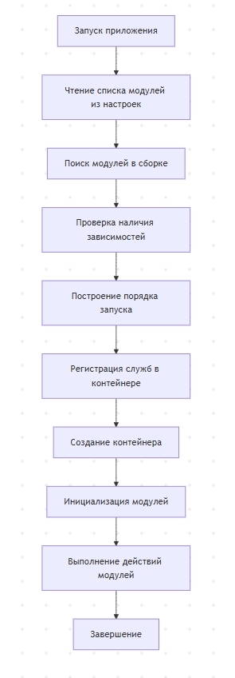

**Практическое занятие №2**

**Мини веб служба и конвейер обработки запросов** 

В  этой  работе  вы  строите  приложение,  которое  можно  расширять модулями  без  переписывания  ядра.  Параллельно  вы  учитесь  собирать зависимости  через  контейнер  внедрения  зависимостей,  чтобы  создание объектов не размазывалось по всему коду. 

Нужно описать контракт модуля расширения, в котором есть имя модуля, список  требуемых  модулей  и  метод  инициализации.  Далее  реализуйте обнаружение  модулей,  либо  через  поиск  в  сборке  с  использованием отражения, либо через список модулей в конфигурации. После обнаружения модулей приложение должно запускать их в корректном порядке, который учитывает  зависимости.  Если  модуль  отсутствует,  приложение  должно объяснить, чего не хватает. Если зависимости образуют цикл, приложение должно остановиться и сообщить о проблеме понятным сообщением. 

Сделайте  не  менее  трѐх  модулей,  которые  реально  меняют  поведение программы.  Например  один  модуль  может  формировать  отчѐт,  другой экспортировать данные в файл, третий добавлять правила проверки данных или дополнительное журналирование. Ценность работы в том, чтобы ядро ничего не знало о деталях модулей, а только подчинялось контракту. 

**[\*] Для усложнения добавьте загрузку модулей из отдельной папки как внешних библиотек. Ещѐ один вариант усложнения это проверка совместимости версий контракта модуля, чтобы приложение не падало** 

**от случайно подключѐнного несовместимого расширения. Можно также показать два времени жизни объектов и доказать это наблюдением в журнале или через проверки.** 

**Итоговое решение включает в себя** 

1. У каждого модуля есть имя, список требуемых модулей и два шага, 

регистрация служб и инициализация. 

2. Приложение читает список модулей из файла настроек и загружает их 

из каталога modules. 

3. Приложение строит порядок запуска модулей, учитывая зависимости. 
3. Если  нужного  модуля  нет,  приложение  завершает  работу  и  пишет 

понятную причину. 

5. Если  зависимости  образуют  цикл,  приложение  завершает  работу  и 

пишет понятную причину. 

6. Модули  регистрируют  свои  службы  через  контейнер  внедрения 

зависимостей. 

7. После запуска модули выполняют свои действия, чтобы было видно, 

что поведение реально меняется. 

**Требования к испытаниям** 

1. Должны быть проверки корректного порядка запуска на нескольких 

наборах зависимостей. 

2. Должна быть проверка ошибки отсутствующего модуля с понятным 

сообщением. 

3. Должна быть проверка ошибки циклических зависимостей с понятным 

сообщением. 

4. Должна  быть  проверка,  что  зависимости  реально  внедряются 

контейнером, а не создаются вручную в модулях. 

**Испытания и проверка результата** 

Нужно  подготовить  проверки,  которые  подтверждают  корректный порядок  запуска  модулей на нескольких наборах зависимостей. Отдельно проверьте сценарий отсутствующего модуля и сценарий цикла зависимостей, причѐм  не  только  факт  ошибки,  но  и  понятность сообщения об ошибке. Дополнительно  добавьте  проверку,  что  зависимости  действительно внедряются контейнером, а не создаются вручную внутри прикладного кода. 

**Что сдавать преподавателю** 

Сдаѐтся  исходный  код,  инструкция  запуска,  набор  проверок  и демонстрационные  сценарии  с  разными  наборами  модулей.  В  пояснении опишите,  какие  части  относятся  к  ядру,  какие  к  модулям,  и  почему добавление нового модуля не требует редактирования логики запуска. 
